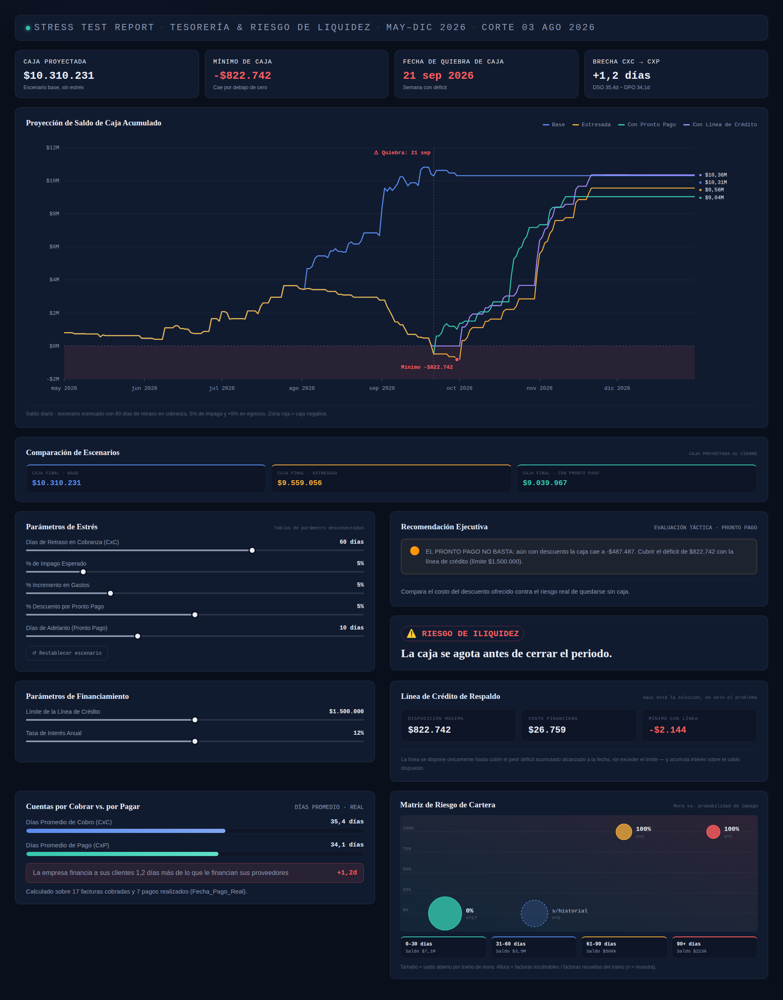
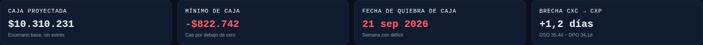
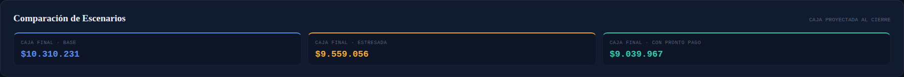
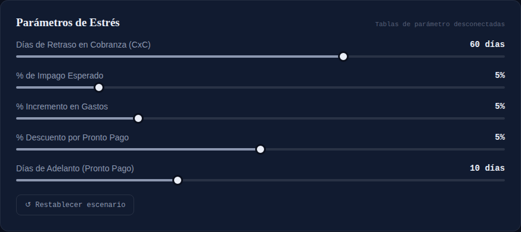
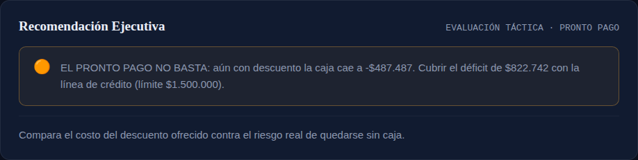
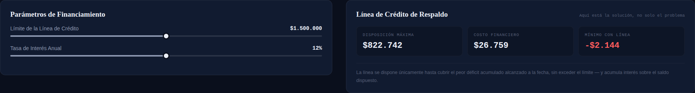
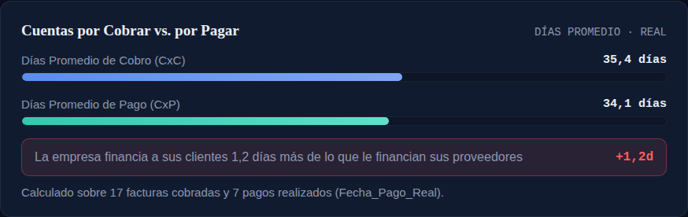
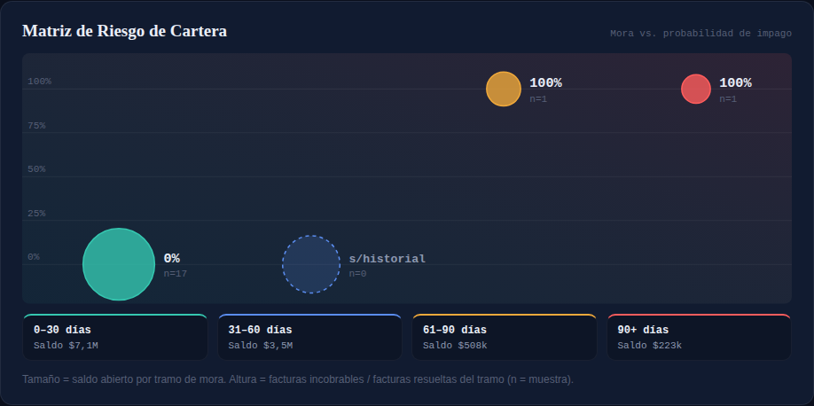
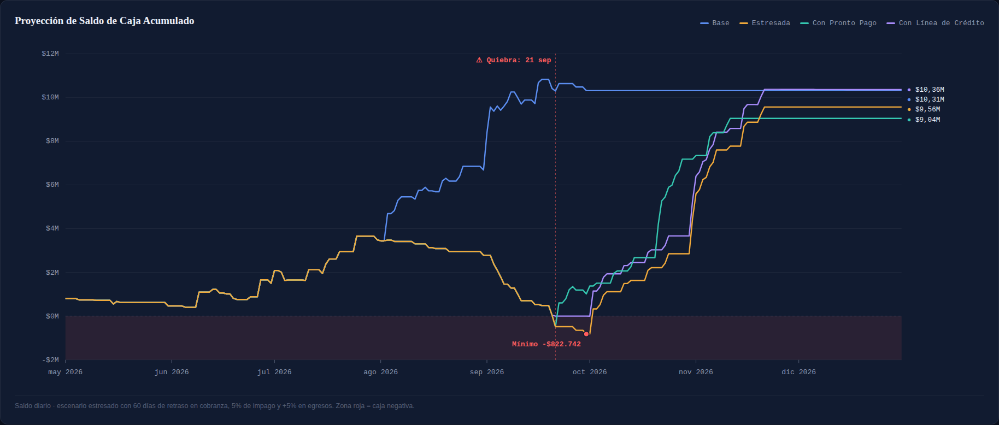

# Cash Flow Stress Testing — Power BI

> **Rentable en papel. Ilíquida en la práctica.**

Muchas empresas quiebran no porque no sean rentables, sino porque se quedan sin efectivo el día equivocado. Este modelo de **Cash Flow Stress Testing** en Power BI responde la pregunta que más le importa a un CFO: no si el negocio va a generar utilidad, sino **si va a tener caja el día que la necesita**.

Proyecta el saldo de caja día a día bajo cuatro escenarios —**base, estresado, con pronto pago y con línea de crédito**— y detecta automáticamente si y cuándo la empresa se queda sin efectivo, incluso cuando el resultado final del periodo es positivo.



📄 **Reporte en PDF:** [`docs/Cash Flow Stress Testing.pdf`](docs/Cash%20Flow%20Stress%20Testing.pdf)

---

## Hallazgo principal

Con el escenario de estrés moderado (60 días de retraso en cobranza, 5% de impago y +5% en egresos):

| Indicador | Resultado |
|---|---|
| Caja al cierre, escenario base | **$10,310,231** |
| Caja al cierre, escenario estresado | **$9,559,056** |
| Mínimo de caja (estresado) | **−$822,742** |
| Fecha de quiebra de caja | **21 sep 2026** |
| Mínimo con pronto pago (5% desc., 10 días) | −$487,487 → el descuento **no basta** |
| Disposición de línea de crédito necesaria | $822,742 (costo financiero $26,759) |

La empresa termina el periodo con más de $9.5M, pero **se queda sin caja a finales de septiembre**. El pronto pago reduce el hueco sin cerrarlo; la línea de crédito de $1.5M sí lo cubre.

---

## Cómo funciona

1. **Fecha de corte.** El último pago real registrado (3 ago 2026) separa lo que ya ocurrió de lo que se proyecta. Lo cobrado y pagado antes del corte queda en su monto y fecha reales.
2. **Escenario base.** La cartera abierta entra en su fecha de vencimiento; las facturas incobrables se excluyen.
3. **Escenario estresado.** Sobre la cartera abierta aplica retraso en cobranza, % de impago e incremento en egresos, todos controlados por sliders.
4. **Pronto pago.** Adelanta la cobranza a cambio de un descuento y compara su costo contra el riesgo de quiebra.
5. **Línea de crédito.** Dispone solo lo necesario para cubrir el peor déficit acumulado, hasta el límite, y acumula interés diario.
6. **Recomendación.** Traduce el resultado en una acción: mantener, aplicar pronto pago, usar la línea o buscar financiamiento adicional.

## Modelo de datos

| Tabla | Tipo | Contenido |
|---|---|---|
| `fact_Cartera_CxC_CxP` | Hechos | Facturas por cobrar y por pagar: emisión, vencimiento, pago real, monto, saldo y estatus (Pagado, Pendiente, Vencido, Incobrable). |
| `fact_Gastos_Fijos_Proyectados` | Hechos | Gastos fijos programados por fecha. |
| `dim_Calendario` | Dimensión | Calendario diario may–dic 2026. Se relaciona con `Fecha_Vencimiento` y `Fecha_Programada`. |
| `dim_Clientes` / `dim_Proveedores` | Dimensión | Terceros, sector, score de riesgo y días de crédito pactados. |
| `Param_*` (7 tablas) | Parámetros what-if | Tablas desconectadas que alimentan los sliders. |
| `Medidas` | Medidas | Tabla contenedora de todas las medidas DAX. |

---

## Medidas DAX

El modelo tiene **58 medidas**. Las de cálculo se documentan abajo con su código; las visuales (HTML) generan los paneles del reporte con el visual *HTML Content*.

### Parámetros (what-if)

Leen el valor seleccionado en cada slider. Las tablas de parámetro están desconectadas del modelo.

| Medida | Qué calcula |
|---|---|
| `Valor de Param_Dias_Retraso_CxC` | Días de retraso aplicados a la cobranza abierta (0–90, paso 15). |
| `Valor de Param_Pct_Impago` | % de la cartera abierta que no se cobra (0–30%). |
| `Valor de Param_Inc_Gastos` | % de incremento en egresos posteriores al corte (0–20%). |
| `Valor de Param_Pronto_Pago` | % de descuento ofrecido por pronto pago (0–10%). |
| `Valor de Param_Dias_Adelanto_PP` | Días que se adelanta la cobranza con pronto pago (0–30). Si el slicer es de rango toma el límite superior. |
| `Valor de Param_Limite_Linea_Credito` | Límite de la línea de crédito de respaldo (0–3,000,000). |
| `Valor de Param_Tasa_Interes_Anual` | Tasa anual de la línea de crédito (0–24%). |
| `dax_Dias_Retraso` | Alias interno del parámetro de retraso. |
| `dax_Pct_Impago` | Alias interno del parámetro de impago. |
| `dax_Inc_Gastos` | Alias interno del parámetro de incremento en gastos. |
| `dax_Pct_Descuento_PP` | Alias interno del % de descuento por pronto pago. |
| `dax_Dias_Adelanto_PP` | Días de adelanto; vale 0 si no hay descuento activo. |

<details><summary><b>Ver código DAX</b></summary>

**Valor de Param_Dias_Retraso_CxC**

```dax
SELECTEDVALUE('Param_Dias_Retraso_CxC'[Param_Dias_Retraso_CxC], 0)
```

**Valor de Param_Pct_Impago**

```dax
SELECTEDVALUE('Param_Pct_Impago'[Param_Pct_Impago], 0)
```

**Valor de Param_Inc_Gastos**

```dax
SELECTEDVALUE('Param_Inc_Gastos'[Param_Inc_Gastos], 0)
```

**Valor de Param_Pronto_Pago**

```dax
SELECTEDVALUE('Param_Pronto_Pago'[Param_Pronto_Pago], 0)
```

**Valor de Param_Dias_Adelanto_PP**

```dax
-- Si el slicer es de rango, toma el límite superior en vez de caer al valor por defecto
IF(
    ISFILTERED('Param_Dias_Adelanto_PP'[Param_Dias_Adelanto_PP]),
    MAX('Param_Dias_Adelanto_PP'[Param_Dias_Adelanto_PP]),
    15
)
```

**Valor de Param_Limite_Linea_Credito**

```dax
SELECTEDVALUE('Param_Limite_Linea_Credito'[Param_Limite_Linea_Credito], 1500000)
```

**Valor de Param_Tasa_Interes_Anual**

```dax
SELECTEDVALUE('Param_Tasa_Interes_Anual'[Param_Tasa_Interes_Anual], 0.12)
```

**dax_Dias_Retraso**

```dax
SELECTEDVALUE(Param_Dias_Retraso_CxC[Param_Dias_Retraso_CxC], 0)
```

**dax_Pct_Impago**

```dax
SELECTEDVALUE(Param_Pct_Impago[Param_Pct_Impago], 0)
```

**dax_Inc_Gastos**

```dax
SELECTEDVALUE(Param_Inc_Gastos[Param_Inc_Gastos], 0)
```

**dax_Pct_Descuento_PP**

```dax
SELECTEDVALUE(Param_Pronto_Pago[Param_Pronto_Pago], 0)
```

**dax_Dias_Adelanto_PP**

```dax
IF([dax_Pct_Descuento_PP] > 0, [Valor de Param_Dias_Adelanto_PP], 0)
```

</details>

### Base y fecha de corte

Separan el flujo real (ya ocurrido) del proyectado. Todo lo anterior a la fecha de corte queda en su monto y fecha reales; el estrés solo toca la cartera abierta.

| Medida | Qué calcula |
|---|---|
| `Caja Inicial` | Saldo de caja al inicio del horizonte ($800,000 al 1 may 2026). |
| `Fecha Corte` | Último `Fecha_Pago_Real` registrado (3 ago 2026). Frontera entre flujo realizado y proyectado. |
| `Ingresos Base` | Cobros CxC: pagados en su fecha real; abiertos en su vencimiento (nunca antes del corte). Excluye incobrables. |
| `Egresos CxP` | Pagos a proveedores: pagados en su fecha real; pendientes en su vencimiento (nunca antes del corte). |
| `Egresos Gastos Fijos` | Gastos fijos proyectados por `Fecha_Programada`. |
| `Egresos Base Total` | Egresos CxP + gastos fijos. |
| `Flujo Neto Base` | Ingresos base − egresos base del periodo en contexto. |

<details><summary><b>Ver código DAX</b></summary>

**Caja Inicial**

```dax
800000
```

**Fecha Corte**

```dax
-- Último movimiento real registrado: todo lo anterior es flujo realizado (no se estresa)
CALCULATE(MAX(fact_Cartera_CxC_CxP[Fecha_Pago_Real]), ALL(fact_Cartera_CxC_CxP), ALL(dim_Calendario))
```

**Ingresos Base**

```dax
-- Cobrado: en Fecha_Pago_Real. Abierto (Pendiente/Vencido): en su vencimiento, nunca antes del corte. Incobrable: excluido.
VAR D0 = MIN(dim_Calendario[Date])
VAR D1 = MAX(dim_Calendario[Date])
VAR Corte = [Fecha Corte]
RETURN
CALCULATE(
    SUMX(
        FILTER(fact_Cartera_CxC_CxP, fact_Cartera_CxC_CxP[Tipo] = "CxC" && fact_Cartera_CxC_CxP[Estatus] <> "Incobrable"),
        VAR EsPagado = fact_Cartera_CxC_CxP[Estatus] = "Pagado"
        VAR F = IF(EsPagado, fact_Cartera_CxC_CxP[Fecha_Pago_Real], MAX(fact_Cartera_CxC_CxP[Fecha_Vencimiento], Corte))
        RETURN IF(F >= D0 && F <= D1, IF(EsPagado, fact_Cartera_CxC_CxP[Monto_Total], fact_Cartera_CxC_CxP[Saldo_Pendiente]))
    ),
    REMOVEFILTERS(dim_Calendario)
)
```

**Egresos CxP**

```dax
-- Pagado: en Fecha_Pago_Real. Pendiente: en su vencimiento, nunca antes del corte.
VAR D0 = MIN(dim_Calendario[Date])
VAR D1 = MAX(dim_Calendario[Date])
VAR Corte = [Fecha Corte]
RETURN
CALCULATE(
    SUMX(
        FILTER(fact_Cartera_CxC_CxP, fact_Cartera_CxC_CxP[Tipo] = "CxP"),
        VAR EsPagado = fact_Cartera_CxC_CxP[Estatus] = "Pagado"
        VAR F = IF(EsPagado, fact_Cartera_CxC_CxP[Fecha_Pago_Real], MAX(fact_Cartera_CxC_CxP[Fecha_Vencimiento], Corte))
        RETURN IF(F >= D0 && F <= D1, IF(EsPagado, fact_Cartera_CxC_CxP[Monto_Total], fact_Cartera_CxC_CxP[Saldo_Pendiente]))
    ),
    REMOVEFILTERS(dim_Calendario)
)
```

**Egresos Gastos Fijos**

```dax
SUM(fact_Gastos_Fijos_Proyectados[Monto_Proyectado])
```

**Egresos Base Total**

```dax
[Egresos CxP] + [Egresos Gastos Fijos]
```

**Flujo Neto Base**

```dax
COALESCE([Ingresos Base], 0) - COALESCE([Egresos Base Total], 0)
```

</details>

### Escenario estresado

Aplica retraso en cobranza, impago e incremento de gastos únicamente a la cartera abierta.

| Medida | Qué calcula |
|---|---|
| `Ingresos Estresados` | Cartera abierta desplazada N días y reducida por el % de impago. |
| `Egresos Estresados` | Egresos posteriores al corte incrementados por el % de gastos. |
| `Flujo Neto Estresado` | Ingresos estresados − egresos estresados. |

<details><summary><b>Ver código DAX</b></summary>

**Ingresos Estresados**

```dax
-- El estrés (retraso + impago) sólo aplica a la cartera abierta; lo ya cobrado queda en su fecha real.
VAR D0 = MIN(dim_Calendario[Date])
VAR D1 = MAX(dim_Calendario[Date])
VAR Corte = [Fecha Corte]
VAR Retraso = [dax_Dias_Retraso]
VAR PctEfectivo = 1 - [dax_Pct_Impago]
RETURN
CALCULATE(
    SUMX(
        FILTER(fact_Cartera_CxC_CxP, fact_Cartera_CxC_CxP[Tipo] = "CxC" && fact_Cartera_CxC_CxP[Estatus] <> "Incobrable"),
        VAR EsPagado = fact_Cartera_CxC_CxP[Estatus] = "Pagado"
        VAR F = IF(EsPagado, fact_Cartera_CxC_CxP[Fecha_Pago_Real], MAX(fact_Cartera_CxC_CxP[Fecha_Vencimiento], Corte) + Retraso)
        RETURN IF(F >= D0 && F <= D1, IF(EsPagado, fact_Cartera_CxC_CxP[Monto_Total], fact_Cartera_CxC_CxP[Saldo_Pendiente] * PctEfectivo))
    ),
    REMOVEFILTERS(dim_Calendario)
)
```

**Egresos Estresados**

```dax
-- El incremento sólo aplica a egresos posteriores al corte; lo ya pagado queda en su monto y fecha real.
VAR D0 = MIN(dim_Calendario[Date])
VAR D1 = MAX(dim_Calendario[Date])
VAR Corte = [Fecha Corte]
VAR Factor = 1 + [dax_Inc_Gastos]
VAR EgresosCxP =
    CALCULATE(
        SUMX(
            FILTER(fact_Cartera_CxC_CxP, fact_Cartera_CxC_CxP[Tipo] = "CxP"),
            VAR EsPagado = fact_Cartera_CxC_CxP[Estatus] = "Pagado"
            VAR F = IF(EsPagado, fact_Cartera_CxC_CxP[Fecha_Pago_Real], MAX(fact_Cartera_CxC_CxP[Fecha_Vencimiento], Corte))
            RETURN IF(F >= D0 && F <= D1, IF(EsPagado, fact_Cartera_CxC_CxP[Monto_Total], fact_Cartera_CxC_CxP[Saldo_Pendiente] * Factor))
        ),
        REMOVEFILTERS(dim_Calendario)
    )
VAR GastosFijos =
    SUMX(
        fact_Gastos_Fijos_Proyectados,
        fact_Gastos_Fijos_Proyectados[Monto_Proyectado] * IF(fact_Gastos_Fijos_Proyectados[Fecha_Programada] > Corte, Factor, 1)
    )
RETURN EgresosCxP + GastosFijos
```

**Flujo Neto Estresado**

```dax
COALESCE([Ingresos Estresados], 0) - COALESCE([Egresos Estresados], 0)
```

</details>

### Pronto pago

Escenario táctico: adelantar la cobranza a cambio de un descuento.

| Medida | Qué calcula |
|---|---|
| `Ingresos con Pronto Pago` | Cartera abierta con retraso neto (retraso − adelanto), neta de impago y descuento. |
| `Costo Pronto Pago` | Descuento sobre lo que realmente se cobraría: saldo abierto sin incobrables × (1 − impago) × % descuento. |

<details><summary><b>Ver código DAX</b></summary>

**Ingresos con Pronto Pago**

```dax
-- Cartera abierta: retraso neto de adelanto, nunca antes del corte; monto neto de impago y descuento.
VAR D0 = MIN(dim_Calendario[Date])
VAR D1 = MAX(dim_Calendario[Date])
VAR Corte = [Fecha Corte]
VAR DiasNetos = [dax_Dias_Retraso] - [dax_Dias_Adelanto_PP]
VAR PctEfectivo = (1 - [dax_Pct_Impago]) * (1 - [dax_Pct_Descuento_PP])
RETURN
CALCULATE(
    SUMX(
        FILTER(fact_Cartera_CxC_CxP, fact_Cartera_CxC_CxP[Tipo] = "CxC" && fact_Cartera_CxC_CxP[Estatus] <> "Incobrable"),
        VAR EsPagado = fact_Cartera_CxC_CxP[Estatus] = "Pagado"
        VAR F = IF(EsPagado, fact_Cartera_CxC_CxP[Fecha_Pago_Real], MAX(MAX(fact_Cartera_CxC_CxP[Fecha_Vencimiento], Corte) + DiasNetos, Corte))
        RETURN IF(F >= D0 && F <= D1, IF(EsPagado, fact_Cartera_CxC_CxP[Monto_Total], fact_Cartera_CxC_CxP[Saldo_Pendiente] * PctEfectivo))
    ),
    REMOVEFILTERS(dim_Calendario)
)
```

**Costo Pronto Pago**

```dax
-- Descuento sobre lo que realmente se cobraría: cartera abierta, sin incobrables, neta de impago
VAR SaldoCobrable =
    CALCULATE(
        SUM(fact_Cartera_CxC_CxP[Saldo_Pendiente]),
        fact_Cartera_CxC_CxP[Tipo] = "CxC",
        NOT fact_Cartera_CxC_CxP[Estatus] IN {"Pagado", "Incobrable"},
        REMOVEFILTERS(dim_Calendario)
    )
RETURN
    SaldoCobrable * (1 - [dax_Pct_Impago]) * [dax_Pct_Descuento_PP]
```

</details>

### Caja acumulada y detección de quiebra

Saldo corrido día a día por escenario y las medidas que detectan si y cuándo la caja cruza cero.

| Medida | Qué calcula |
|---|---|
| `Caja Acumulada Base` | Caja inicial + flujo base acumulado hasta la fecha del eje. |
| `Caja Acumulada Estresada` | Caja inicial + flujo estresado acumulado. |
| `Caja Acumulada con Pronto Pago` | Caja inicial + ingresos con pronto pago − egresos estresados, acumulado. |
| `Minimo de Caja` | Menor saldo de la caja estresada en el periodo seleccionado. |
| `Fecha Quiebra Caja` | Primer día en que la caja estresada es negativa. |
| `Alerta Liquidez` | Texto de estado: ⚠️ riesgo de iliquidez / ✅ posición sana. |

<details><summary><b>Ver código DAX</b></summary>

**Caja Acumulada Base**

```dax
VAR FechaGrafico = MAX(dim_Calendario[Date])
RETURN
IF(
    ISBLANK(FechaGrafico),
    BLANK(),
    [Caja Inicial]
        + CALCULATE(
            COALESCE([Ingresos Base], 0) - COALESCE([Egresos Base Total], 0),
            REMOVEFILTERS(dim_Calendario),
            dim_Calendario[Date] <= FechaGrafico
        )
)
```

**Caja Acumulada Estresada**

```dax
VAR FechaGrafico = MAX(dim_Calendario[Date])
RETURN
IF(
    ISBLANK(FechaGrafico),
    BLANK(),
    [Caja Inicial]
        + CALCULATE(
            COALESCE([Ingresos Estresados], 0) - COALESCE([Egresos Estresados], 0),
            REMOVEFILTERS(dim_Calendario),
            dim_Calendario[Date] <= FechaGrafico
        )
)
```

**Caja Acumulada con Pronto Pago**

```dax
VAR FechaGrafico = MAX(dim_Calendario[Date])
RETURN
IF(
    ISBLANK(FechaGrafico),
    BLANK(),
    [Caja Inicial]
        + CALCULATE(
            COALESCE([Ingresos con Pronto Pago], 0) - COALESCE([Egresos Estresados], 0),
            REMOVEFILTERS(dim_Calendario),
            dim_Calendario[Date] <= FechaGrafico
        )
)
```

**Minimo de Caja**

```dax
MINX(
    ALLSELECTED(dim_Calendario[Date]),
    [Caja Acumulada Estresada]
)
```

**Fecha Quiebra Caja**

```dax
CALCULATE(
    MIN(dim_Calendario[Date]),
    FILTER(
        ALLSELECTED(dim_Calendario),
        [Caja Acumulada Estresada] < 0
    )
)
```

**Alerta Liquidez**

```dax
VAR MinimoCaja = [Minimo de Caja]
RETURN
IF(
    MinimoCaja < 0,
    "⚠️ RIESGO DE ILIQUIDEZ",
    "✅ POSICIÓN SANA"
)
```

</details>

### Línea de crédito

Financiamiento puente: se dispone solo lo necesario para cubrir el peor déficit acumulado a la fecha, hasta el límite, con interés diario.

| Medida | Qué calcula |
|---|---|
| `Linea de Credito Dispuesta Acumulada` | Monto dispuesto a la fecha: mín(límite, peor déficit acumulado hasta ese día). |
| `Interes Acumulado Linea de Credito` | Interés diario acumulado sobre el saldo dispuesto. |
| `Caja Acumulada Estresada con Linea de Credito` | Caja estresada + línea dispuesta − interés acumulado. |
| `Minimo de Caja con Linea de Credito` | Menor saldo del escenario con línea. |
| `Fecha Quiebra Caja con Linea de Credito` | Primer día negativo aun con la línea. |
| `Alerta Liquidez con Linea de Credito` | Indica si la línea cubre el déficit o es insuficiente. |
| `Disposicion Maxima Requerida` | Alias de la disposición acumulada, para tarjetas. |

<details><summary><b>Ver código DAX</b></summary>

**Linea de Credito Dispuesta Acumulada**

```dax
VAR FechaGrafico = MAX(dim_Calendario[Date])
VAR TablaFechas = CALCULATETABLE(VALUES(dim_Calendario[Date]), ALL(dim_Calendario), dim_Calendario[Date] <= FechaGrafico)
VAR PeorSaldoHastaHoy = MINX(TablaFechas, CALCULATE([Caja Acumulada Estresada]))
VAR NecesidadMaxima = MAX(0, -PeorSaldoHastaHoy)
RETURN
    IF(
        ISBLANK(FechaGrafico),
        BLANK(),
        MIN([Valor de Param_Limite_Linea_Credito], NecesidadMaxima)
    )
```

**Interes Acumulado Linea de Credito**

```dax
VAR FechaGrafico = MAX(dim_Calendario[Date])
VAR TablaFechas = CALCULATETABLE(VALUES(dim_Calendario[Date]), ALL(dim_Calendario), dim_Calendario[Date] <= FechaGrafico)
VAR TasaDiaria = [Valor de Param_Tasa_Interes_Anual] / 365
RETURN
    IF(
        ISBLANK(FechaGrafico),
        BLANK(),
        SUMX(TablaFechas, CALCULATE([Linea de Credito Dispuesta Acumulada]) * TasaDiaria)
    )
```

**Caja Acumulada Estresada con Linea de Credito**

```dax
[Caja Acumulada Estresada] + [Linea de Credito Dispuesta Acumulada] - [Interes Acumulado Linea de Credito]
```

**Minimo de Caja con Linea de Credito**

```dax
MINX(ALLSELECTED(dim_Calendario[Date]), [Caja Acumulada Estresada con Linea de Credito])
```

**Fecha Quiebra Caja con Linea de Credito**

```dax
CALCULATE(
    MIN(dim_Calendario[Date]),
    FILTER(ALLSELECTED(dim_Calendario), [Caja Acumulada Estresada con Linea de Credito] < 0)
)
```

**Alerta Liquidez con Linea de Credito**

```dax
VAR MinimoCaja = [Minimo de Caja con Linea de Credito]
RETURN
IF(
    MinimoCaja < 0,
    "⚠️ RIESGO DE ILIQUIDEZ (línea insuficiente)",
    "✅ CUBIERTO POR LÍNEA DE CRÉDITO"
)
```

**Disposicion Maxima Requerida**

```dax
[Linea de Credito Dispuesta Acumulada]
```

</details>

### Recomendación ejecutiva

Traduce los escenarios en una decisión.

| Medida | Qué calcula |
|---|---|
| `Estado Recomendacion` | (Oculta) 0 = mantener · 1 = aplicar pronto pago · 2 = pronto pago no basta, usar línea · 3 = déficit mayor que la línea. |
| `Evaluacion Tacita Pronto Pago` | Texto de la recomendación según el estado, con los montos del escenario. |

<details><summary><b>Ver código DAX</b></summary>

**Estado Recomendacion**

```dax
-- 0 = Mantener | 1 = Aplicar pronto pago | 2 = Pronto pago no basta, usar línea | 3 = Déficit mayor a la línea
VAR MinEst = [Minimo de Caja]
VAR MinPP = MINX(ALLSELECTED(dim_Calendario[Date]), [Caja Acumulada con Pronto Pago])
VAR HayDescuento = [dax_Pct_Descuento_PP] > 0
VAR Limite = [Valor de Param_Limite_Linea_Credito]
RETURN
SWITCH(TRUE(),
    MinEst >= 0, 0,
    HayDescuento && MinPP >= 0, 1,
    -MinEst <= Limite, 2,
    3
)
```

**Evaluacion Tacita Pronto Pago**

```dax
VAR Estado = [Estado Recomendacion]
VAR MinEst = [Minimo de Caja]
VAR MinPP = MINX(ALLSELECTED(dim_Calendario[Date]), [Caja Acumulada con Pronto Pago])
VAR Costo = [Costo Pronto Pago]
VAR Limite = [Valor de Param_Limite_Linea_Credito]
VAR HayDescuento = [dax_Pct_Descuento_PP] > 0
RETURN
SWITCH(
    Estado,
    0, "MANTENER: la caja resiste el escenario estresado; no se requiere ofrecer descuento.",
    1, "APLICAR PRONTO PAGO: evita la quiebra de caja con un costo de " & FORMAT(Costo, "$#,##0") & " en margen.",
    2, IF(HayDescuento, "EL PRONTO PAGO NO BASTA: aún con descuento la caja cae a " & FORMAT(MinPP, "$#,##0") & ". ", "")
        & "Cubrir el déficit de " & FORMAT(-MinEst, "$#,##0") & " con la línea de crédito (límite " & FORMAT(Limite, "$#,##0") & ").",
    "RIESGO CRÍTICO: el déficit de " & FORMAT(-MinEst, "$#,##0") & " supera la línea de crédito (" & FORMAT(Limite, "$#,##0") & "). Se requiere financiamiento adicional o renegociar pagos."
)
```

</details>

### Capital de trabajo y riesgo de cartera

Métricas reales calculadas sobre facturas ya liquidadas.

| Medida | Qué calcula |
|---|---|
| `DSO Real (dias)` | Días promedio de cobro: emisión → pago real, facturas CxC pagadas. |
| `DPO Real (dias)` | Días promedio de pago: emisión → pago real, facturas CxP pagadas. |
| `Brecha CxC vs CxP (dias)` | DSO − DPO: días que la empresa financia a sus clientes con caja propia. |

<details><summary><b>Ver código DAX</b></summary>

**DSO Real (dias)**

```dax
AVERAGEX(
    FILTER(fact_Cartera_CxC_CxP, fact_Cartera_CxC_CxP[Tipo]="CxC" && fact_Cartera_CxC_CxP[Estatus]="Pagado"),
    DATEDIFF(fact_Cartera_CxC_CxP[Fecha_Emision], fact_Cartera_CxC_CxP[Fecha_Pago_Real], DAY)
)
```

**DPO Real (dias)**

```dax
AVERAGEX(
    FILTER(fact_Cartera_CxC_CxP, fact_Cartera_CxC_CxP[Tipo]="CxP" && fact_Cartera_CxC_CxP[Estatus]="Pagado"),
    DATEDIFF(fact_Cartera_CxC_CxP[Fecha_Emision], fact_Cartera_CxC_CxP[Fecha_Pago_Real], DAY)
)
```

**Brecha CxC vs CxP (dias)**

```dax
[DSO Real (dias)] - [DPO Real (dias)]
```

</details>

### Diagnóstico

Medidas auxiliares para validar el modelo (no se usan en visuales).

| Medida | Qué calcula |
|---|---|
| `Ingresos Acumulada Base` | Caja inicial + ingresos base acumulados. |
| `Egresos Acumulados Base` | Caja inicial − egresos base acumulados. |
| `Ingresos Acumulados Estresados` | Ingresos estresados acumulados. |
| `Egresos Acumulados Estresados` | Egresos estresados acumulados. |
| `Ingresos Acumulados con Pronto Pago` | Ingresos con pronto pago acumulados. |

<details><summary><b>Ver código DAX</b></summary>

**Ingresos Acumulada Base**

```dax
VAR FechaGrafico = MAX(dim_Calendario[Date])
RETURN
IF(
    ISBLANK(FechaGrafico),
    BLANK(),
    [Caja Inicial] + CALCULATE(COALESCE([Ingresos Base], 0), REMOVEFILTERS(dim_Calendario), dim_Calendario[Date] <= FechaGrafico)
)
```

**Egresos Acumulados Base**

```dax
VAR FechaGrafico = MAX(dim_Calendario[Date])
RETURN
IF(
    ISBLANK(FechaGrafico),
    BLANK(),
    [Caja Inicial] - CALCULATE(COALESCE([Egresos Base Total], 0), REMOVEFILTERS(dim_Calendario), dim_Calendario[Date] <= FechaGrafico)
)
```

**Ingresos Acumulados Estresados**

```dax
VAR FechaGrafico = MAX(dim_Calendario[Date])
RETURN
IF(
    ISBLANK(FechaGrafico),
    BLANK(),
    CALCULATE([Ingresos Estresados], REMOVEFILTERS(dim_Calendario), dim_Calendario[Date] <= FechaGrafico)
)
```

**Egresos Acumulados Estresados**

```dax
VAR FechaGrafico = MAX(dim_Calendario[Date])
RETURN
IF(
    ISBLANK(FechaGrafico),
    BLANK(),
    CALCULATE([Egresos Estresados], REMOVEFILTERS(dim_Calendario), dim_Calendario[Date] <= FechaGrafico)
)
```

**Ingresos Acumulados con Pronto Pago**

```dax
VAR FechaGrafico = MAX(dim_Calendario[Date])
RETURN
IF(
    ISBLANK(FechaGrafico),
    BLANK(),
    CALCULATE([Ingresos con Pronto Pago], REMOVEFILTERS(dim_Calendario), dim_Calendario[Date] <= FechaGrafico)
)
```

</details>

### Medidas visuales (HTML Content)

Devuelven HTML/SVG con estilo propio (Fraunces, Inter, JetBrains Mono sobre fondo `#0A0F1C`). El código completo está en [`Cash Flow Stress Testing.SemanticModel/definition/tables/Medidas.tmdl`](Cash%20Flow%20Stress%20Testing.SemanticModel/definition/tables/Medidas.tmdl).

| Medida | Panel |
|---|---|
| `HTML_Eyebrow` | Encabezado del reporte con el periodo y la fecha de corte dinámicos. |
| `HTML_KPI_Cards` | Franja de 4 KPIs: caja proyectada, mínimo de caja, fecha de quiebra y brecha CxC→CxP. |
| `HTML_Comparacion_Escenarios` | Caja final de los escenarios base, estresado y con pronto pago. |
| `HTML_Recomendacion` | Panel de recomendación ejecutiva con ícono y color según `Estado Recomendacion`. |
| `HTML_Verdict_Card` | Veredicto: riesgo de iliquidez o posición sana. |
| `HTML_Linea_Credito` | Panel de línea de crédito: disposición máxima, costo financiero y mínimo con línea. |
| `HTML_Bridge_CxC_CxP` | Barras DSO vs DPO y la brecha de financiamiento. |
| `HTML_Risk_Matrix` | Matriz de burbujas (SVG): tramo de mora vs probabilidad de impago, tamaño = saldo expuesto. |
| `HTML_KPI_MinimoCaja` | Tarjeta individual de mínimo de caja (versión anterior a `HTML_KPI_Cards`). |
| `HTML_KPI_FechaQuiebra` | Tarjeta individual de fecha de quiebra (versión anterior a `HTML_KPI_Cards`). |
| `HTML_Banner_CobranzaVsEgresos` | Banner de cobranza vs egresos del mes con la última fecha de pago real. |

---

## Galería

| | |
|---|---|
| **KPIs**  | **Comparación de escenarios**  |
| **Parámetros de estrés**  | **Recomendación ejecutiva**  |
| **Línea de crédito**  | **Veredicto**  |
| **CxC vs CxP**  | **Matriz de riesgo de cartera**  |

**Trayectoria de caja por escenario**



> Las imágenes se generaron con los valores reales que devuelve el modelo para el escenario moderado.

## Estructura del repositorio

```
├── Cash Flow Stress Testing.pbip          # Abrir con Power BI Desktop
├── Cash Flow Stress Testing.Report/       # Reporte (formato PBIR)
├── Cash Flow Stress Testing.SemanticModel/# Modelo semántico (TMDL)
├── cash-flow-stress-testing-theme.json    # Tema de colores del reporte
├── cash-flow-stress-test-dashboard*.html  # Mockups interactivos del diseño
├── gemini-code-*.txt                      # Datos de origen (CSV)
└── docs/
    ├── Cash Flow Stress Testing.pdf       # Reporte exportado
    └── img/                               # Capturas del diseño
```

## Cómo abrirlo

1. Instala Power BI Desktop con la vista previa de **Power BI Project (.pbip)** habilitada.
2. Clona el repositorio y abre `Cash Flow Stress Testing.pbip`.
3. Las fuentes apuntan a los archivos `gemini-code-*.txt`: actualiza la ruta en Power Query (*Transformar datos → Configuración de origen de datos*) a la carpeta donde clonaste el repo y refresca.
4. El reporte usa el visual personalizado **HTML Content**; Power BI lo descarga de AppSource al abrir.

**Stack:** Power BI Desktop · DAX · Power Query · TMDL / PBIR · HTML Content visual
